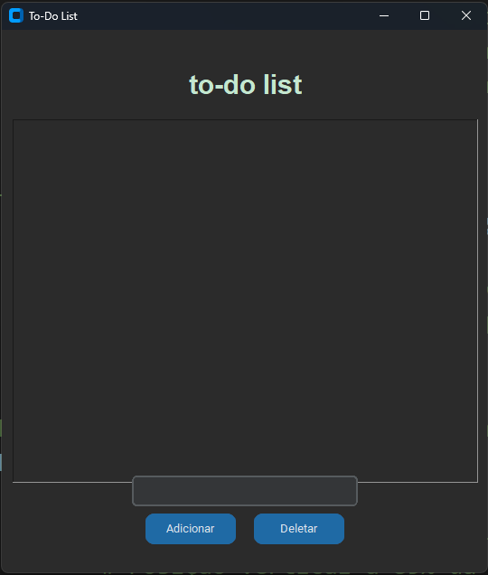

# To-Do List 📝
Este é um aplicativo simples de lista de tarefas (To-Do List) desenvolvido em Python, utilizando as bibliotecas **CustomTkinter** e **Tkinter** para criar uma interface gráfica. 
  
O projeto permite que o usuário adicione e remova tarefas de uma lista, proporcionando uma maneira rápida e fácil de gerenciar tarefas diárias.

## Funcionalidades

- ➕ **Adicionar Tarefa**: Adiciona uma nova tarefa à lista de tarefas.
- 🗑️ **Deletar Tarefa**: Remove a tarefa selecionada da lista.
- 🎨 **Interface Personalizada**: Interface gráfica com estilo moderno usando CustomTkinter e o Tkinter.
  

## Tela da Aplicação

  

## Pré-requisitos

Para executar este projeto, é necessário ter o **Python** instalado e as seguintes bibliotecas:

- `customtkinter`
- `tkinter`
  

##  🚀 Inicializando o Projeto

### 1. Clone o repositório:
`git clone https://github.com/Raone-souza/to-do_list.git`

### 2. Acesse a pasta do projeto:
`cd to-do-list` 

### 3. Execute o aplicativo:
`python app.py`

### 🎉 Agora você deve ser capaz de acessar a aplicação e gerenciar suas tarefas.
 

### 🎨 Personalização

Para personalizar o visual do aplicativo, você pode alterar os valores de cor e fonte no código.

- **Cores**: Modifique as cores do fundo e do texto para se adequar ao seu estilo pessoal.
- **Fontes**: Ajuste o tipo e tamanho das fontes na interface para melhor visualização.
 

### 🌐 Estrutura do Código

| Arquivo          | Descrição                                                                         |
|------------------|-----------------------------------------------------------------------------------|
| `to_do_list.py`  | Arquivo principal do projeto, contendo toda a lógica e interface da lista de tarefas. |
 

## `👤 Desenvolvido por Raone Castro`